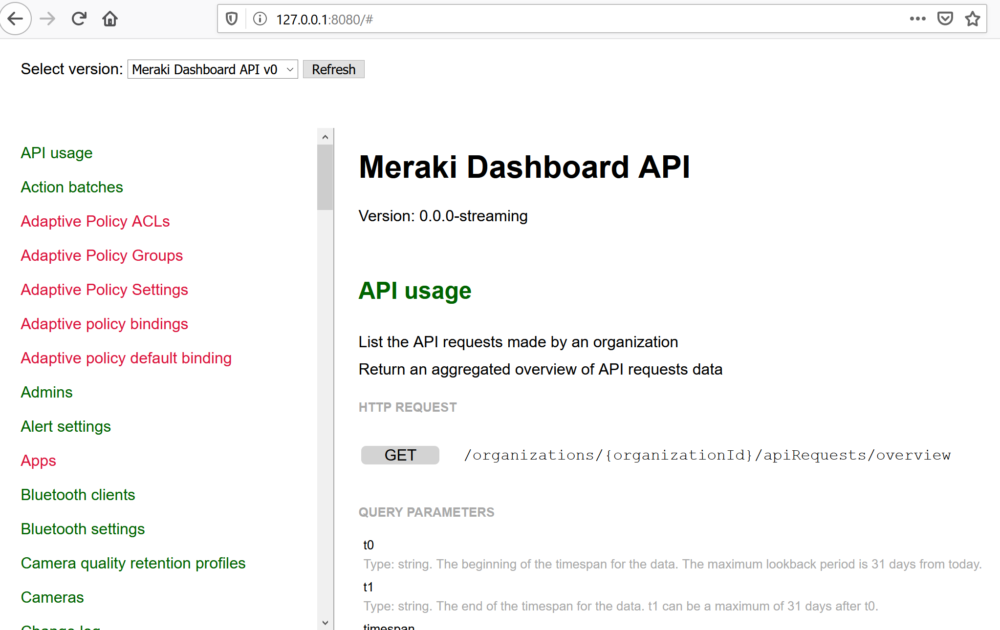

# meraki-diff-docs
Documentation page for the Meraki Dashboard API that highlights limited access endpoints.

# The use case
This project is intended for experienced users of the Meraki Dashboard API, possibly members of the Developer Early Access Community. The project creates a minimalistic documentation page that uses red/green/orange colour coding to highlight which endpoints are in general availability status (and usable on all customer organisations) and which are visible through having enrolled into initiatives that provide access to extra endpoints, which might not be available to everyone.

# Project overview
The project creates a node.js web server, which provides the documentation page and handles communication with the Meraki Dashboard API.

# Prerequisites
To use this project, you will need the following:
* Two Meraki organizations:
- One with special API endpoints enabled, for example through participation in the Developer Early Access Program: https://developer.cisco.com/meraki/meraki-developer-early-access-program/
- One with no special features enabled. You can create a new blank organization for this use. You don't need to add devices or licenses
- Both organizations need to have Dashboard API access enabled 
* A Meraki dashboard administrator account with at least read access to both of these organisations and an API key

# Installation and startup
* Install node.js: https://nodejs.org/en/
* Copy the contents or this repository to your server
* Edit file /models/Config.js
* Find the following text:
```
// Edit this to match the Meraki Dashboard API key you want to use
this.apiKey         = '1234'; 

// Edit this to match the organizationId of your "General availability" organization, ie. the
// one that does not have any limited access API endpoints enabled.
this.gaOrgId        = '4567'; 

// Edit this to match the organizationId of your "Beta" organization, ie. the
// one that has limited access API endpoints enabled.
this.betaOrgId      = '6543';
```
* Replace the contents of the strings to match your environment
* In the installation directory, run the following commands:
```
npm install
node server.js
```
* By default, the server will run on TCP port 8080, and the documentation page can be accessed by navigating with a web browser to:
```
http://yourServersIpAddress:8080
```

# Screenshot


# Useful links
The official Meraki API developer page: https://developer.cisco.com/meraki
